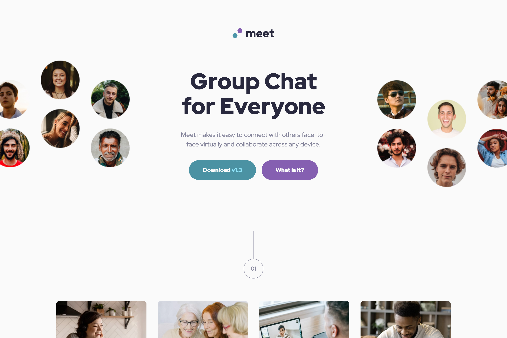

# Frontend Mentor - Meet landing page solution

This is a solution to the [Meet landing page challenge on Frontend Mentor](https://www.frontendmentor.io/challenges/meet-landing-page-rbTDS6OUR). Frontend Mentor challenges help you improve your coding skills by building realistic projects.

## Table of contents

- [Overview](#overview)
  - [The challenge](#the-challenge)
  - [Screenshot](#screenshot)
  - [Links](#links)
- [My process](#my-process)
  - [Built with](#built-with)
  - [What I learned](#what-i-learned)
  - [Continued development](#continued-development)
  - [Useful resources](#useful-resources)
- [Author](#author)

## Overview

### The challenge

Users should be able to:

- View the optimal layout depending on their device's screen size
- See hover states for interactive elements

### Screenshot



### Links

- Solution URL: [GihHub repo](https://github.com/bulhakovolexii/meet-landing-page/)
- Live Site URL: [GitHub pages](https://bulhakovolexii.github.io/meet-landing-page/)

## My process

### Built with

- Semantic HTML5 markup
- CSS Grid
- Flexbox
- Mobile-first workflow
- [Tailwind CSS](https://tailwindcss.com/)

### What I learned

In this task, I tried using Tailwind for the first time. I had to apply quite a few different approaches that were new to me. For example, I started by overriding some default variables to match the design:

```css
@theme {
  --font-sans: "Red Hat Display", sans-serif;

  --color-cyan-300: oklch(0.87 0.0868 215.42);
  --color-cyan-500: oklch(0.76 0.0827 215.89);
  --color-cyan-600: oklch(0.62 0.075853 216.1335);

  --color-white: #fafafa;

  --text-base: 1rem;
  --text-base--line-height: 1.5;
  --text-lg: 1.125rem;
  --text-lg--line-height: 1.1;
}

@layer theme {
  body {
    @apply text-slate-900;
  }
}
```

Some repeating elements had to be extracted into components. For example:

```css
@layer components {
  .img {
    @apply min-h-36 rounded-lg object-cover md:min-h-40 lg:min-h-64;
  }
}
```

Overall, I’m satisfied with the new experience of working with this framework, though it’s clear I still need more practice.

Initially, I built the page without following a mobile-first approach, which made working with breakpoints inconvenient. So I restructured the layout starting from the mobile design.

### Continued development

If you’d like to run this project locally, to compile the styles, run the command `npm install` followed by `npm run dev`.

### Useful resources

- [Tailwind CSS installation](https://tailwindcss.com/docs/installation/tailwind-cli) - The simplest and fastest way to get up and running with Tailwind CSS from scratch is with the Tailwind CLI tool.

## Author

- GitHub - [@bulhakovolexii](https://github.com/bulhakovolexii)
- Frontend Mentor - [@bulhakovolexii](https://www.frontendmentor.io/profile/bulhakovolexii)
- LinkedIn - [@bulhakovolexii](https://www.linkedin.com/in/bulhakovolexii/)
